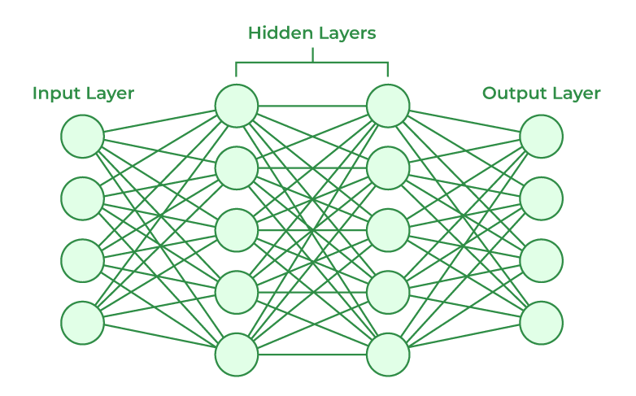
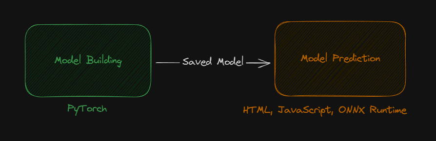
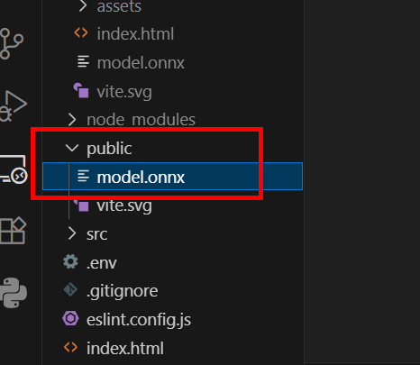

<style>
@import url('https://fonts.googleapis.com/css2?family=Prompt:ital,wght@0,100;0,300;0,400;0,700;1,100;1,300;1,400;1,700&display=swap');

    :root {
    font-family: Prompt;
    --hl-color: #D57E7E;
}
h1 {
  font-family: Prompt
}
</style>

# Information Technologies for Industrial Engineers

## เทคโนโลยีสารสนเทศสำหรับวิศวกรอุตสาหการ

---

# AI-powered Application

---

# Artifical Neural Network

- A computing system modeled after the human brain's structure and function
  - Used in machine learning and AI to identify patterns, make predictions, and learn from data.
- Consist of interconnected `nodes` (artificial neurons) organized in `layers` (_input, hidden, and output_)
  - Information is processed through weighted connections and `activation functions`.

---



---

# House Price Prediction (with ANN)

---

# Model building



---

# ONNX

- _Open Neural Network Exchange_ [(Link)](https://onnx.ai/)
- An open-source, standardized format for representing and exchanging machine learning models.
- Allows us to transfer model between differen languages and runtimes.

---

# Google Colab

- https://colab.research.google.com/drive/1BdvM1OKY5lj6hmWHv9WP3FSlmExgh9rr?usp=sharing
- You should get `model.onnx`

---

# Model prediction

> House Price Prediction (with ANN)

---

# Setting up

- `pnpm create vite@latest`
- ...

---

# Library installation

- `pnpm install onnxruntime-web`
- `pnpm approve-builds`
  - Choose `protobufjs`

---

# Model location

- Place the model in `./public/model` folder
  

---

`vite.config.ts`

```ts
import { defineConfig } from "vite";
import react from "@vitejs/plugin-react-swc";
export default defineConfig({
  plugins: [react()],
  assetsInclude: ["**/*.onnx"],
  optimizeDeps: {
    exclude: ["onnxruntime-web"],
  },
});
```

---

`./src/model.ts`

```ts
import * as ort from "onnxruntime-web";
export async function load_model() {
  // Path must be relative to public folder in Vite projects
  const modelUrl = `/model.onnx`;

  // Create session
  const session = await ort.InferenceSession.create(modelUrl);
  return session;
}
export { ort };
```

---

# `App.tsx`

https://github.com/it-for-ie-68/ml-house-price/blob/main/src/App.tsx

---

# Verify this

- Make sure that these values are correct!

```ts
function handleOutput(output: any) {
  // Change here
  const X_min = 800000;
  const X_max = 2000000;
  //
}
```

```ts
function handleArea(input: string) {
  // Change here
  const mean = 1275.25;
  const std = 353.78480394;
  //
}
```

---

# CSS (Optional)

- Clear `import './index.css'` in `main.tsx`
- Insert this in `index.html`
  - [picocss](https://picocss.com/)

```html
  <head>
  ...
    <link
      rel="stylesheet"
      href="https://cdn.jsdelivr.net/npm/@picocss/pico@2/css/pico.violet.min.css"
    />
  </head>

</html>

```

---

# Build and Deploy

- `pnpm run build`
- Deploy to [Netlify](https://www.netlify.com/).
