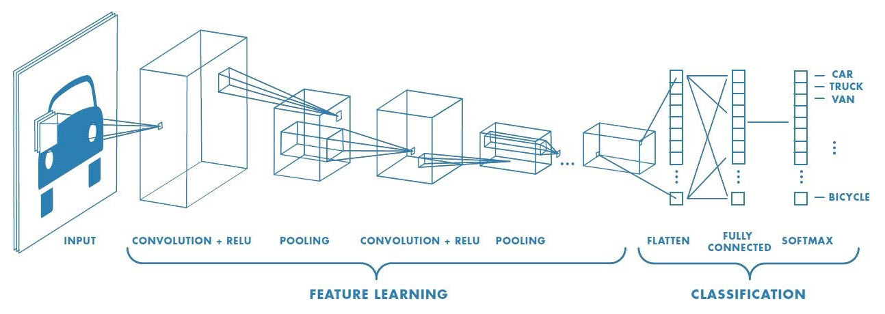
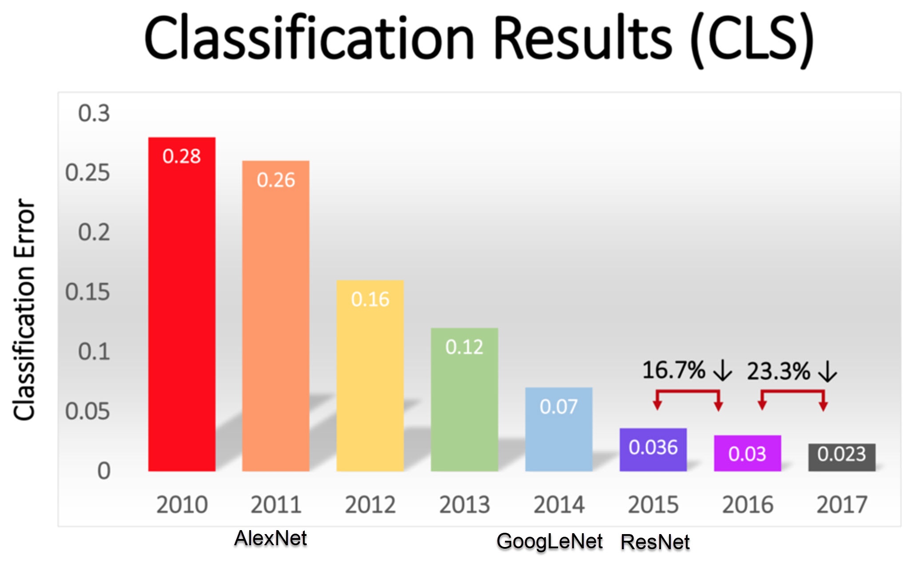
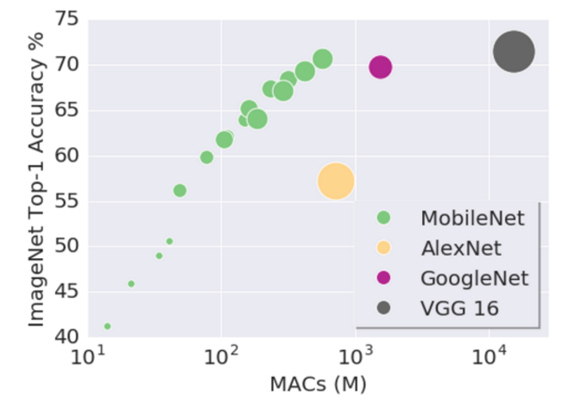
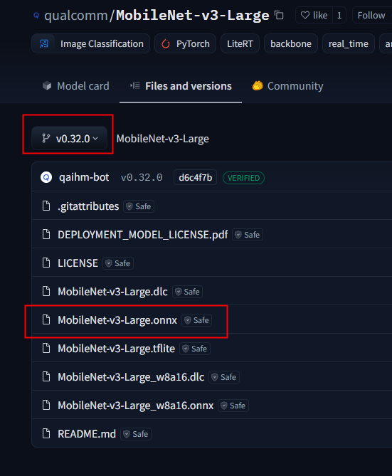
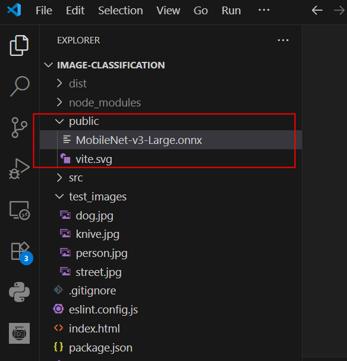
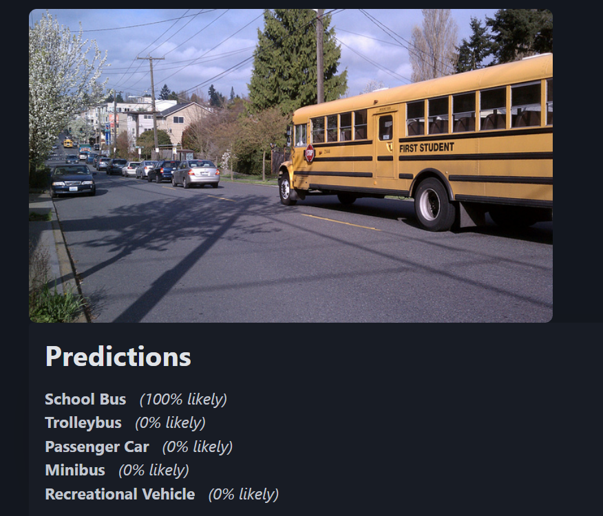
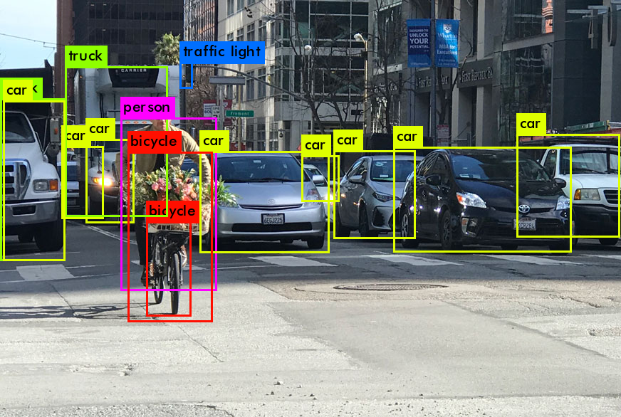
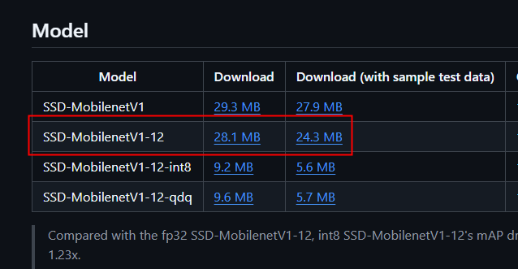
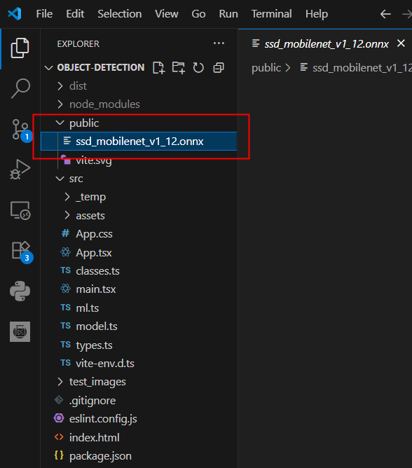

# Information Technologies for Industrial Engineers

## เทคโนโลยีสารสนเทศสำหรับวิศวกรอุตสาหการ

---

# Computer vision

- Field of computer science that focuses on enabling computers to identify and understand objects and people in images and videos.
- Computer vision seeks to perform and automate tasks that replicate human capabilities.
  - The way humans see.

---

# Convolutional neural network

- Deep Learning algorithm that can take in an input image and be able to differentiate one from the other.
- The architecture of a `ConvNet` is analogous to that of the connectivity pattern of Neurons in the human brain and the visual cortex.

---

[Source](https://saturncloud.io/blog/a-comprehensive-guide-to-convolutional-neural-networks-the-eli5-way/)

---

# Image classification

- Dog (50%)
- ... (15%)
- ... (15%)

---

# ILSVRC competition

- ImageNet Large Scale Visual Recognition Challenge
  - Started 2010
- Task
  - Evaluates algorithms for object detection and image classification at large scale.
- Data
  - 15 million images
  - 22000 categories

---

## 

---

- Y-axis: Top-5 error
- Exceed human ability @ 2015

---

# Current ranking

https://paperswithcode.com/sota/image-classification-on-imagenet

> (Link is not working, unfortunately. See [this](https://web.archive.org/web/20240617215526/https://paperswithcode.com/sota/image-classification-on-imagenet) instead)

---

# MobileNet

- MobileNet is a simple but efficient and not very computationally intensive convolutional neural networks for mobile vision applications
- [Info](https://medium.com/@RobuRishabh/understanding-and-implementing-mobilenetv3-422bd0bdfb5a)
  

---

# Model File

- [ONNX](https://huggingface.co/qualcomm/MobileNet-v3-Large)

---

# Let's do it

---

# Install

- `pnpm create vite@latest`
- ...
- `pnpm i onnxruntime-web jimp`
- `pnpm approve-builds`
  - Approve all packages.
- `pnpm i -D @jimp/types`

---

# Image Model

---

# Setup

- [`./vite/config.ts`](https://github.com/it-for-ie-68/image-classification/blob/main/vite.config.ts)
  - Make `onnx` extension available in `public` folder.
- [`./main.tsx`](https://github.com/it-for-ie-68/image-classification/blob/main/src/main.tsx)
  - Remove css import.
- [`./index.html`](https://github.com/it-for-ie-68/image-classification/blob/main/index.html)
  - Add `PicoCSS`

---

# Core Code

- [`./src/model.ts`](https://github.com/it-for-ie-68/image-classification/blob/main/src/model.ts)
- [`./src/ml.ts`](https://github.com/it-for-ie-68/image-classification/blob/main/src/ml.ts)
- [`./src/classes.ts`](https://github.com/it-for-ie-68/image-classification/blob/main/src/classes.ts)
- [`./src/App.tsx`](https://github.com/it-for-ie-68/image-classification/blob/main/src/App.tsx)

---

# Build and Deploy

- `pnpm run build`
- Deploy on `Netlify`

---

# Limitation

There are many things in this image.

---

# Object detection

- Car
  - Top: 500, Bottom: 200, Left: 50, right: 400
  - 50%
- Bicycle
  - ...
  - ...

---

# Models

- **YOLO** (You Only Look Once)
  - Grid-based approach
  - Faster, less accurate
- **SSD** (Single Shot Detector)
  - Feature-map approach
  - Faster, less accurate (comparable to YOLO)
- **R-CNN** (Region-based Convolutional Neural Network)
  - Pixel classification
  - Slower, more accurate

[Source](https://towardsdatascience.com/the-basics-of-object-detection-yolo-ssd-r-cnn-6def60f51c0b)

---

# COCO dataset

- _Common Objects in Context_
- Large-scale image recognition dataset for object detection, segmentation, and captioning tasks.
  - Contains over 330,000 images.
  - Annotated with 80 object categories.
- https://cocodataset.org/#explore

---

# `SSD-MobilenetV1`

- This model detects objects defined in the COCO dataset.
- Uses SSD algorithm
- Classify using MobilenetV1.

---

# Model Download

[Link](https://github.com/onnx/models/tree/main/validated/vision/object_detection_segmentation/ssd-mobilenetv1)

---

# Object Detection App

---

# Setting up

- `pnpm create vite@latest`
- ...
- `pnpm i onnxruntime-web jimp`
- `pnpm approve-builds`
  - Approve all packakges.
- `pnpm i -D @jimp/types`

---

# Model

---

# Setup

- [`./vite/config.ts`](https://github.com/it-for-ie-68/object-detection/blob/main/vite.config.ts)
  - Make `onnx` extension available in `public` folder.
- [`./main.tsx`](https://github.com/it-for-ie-68/object-detection/blob/main/src/main.tsx)
  - Remove css import.
- [`./index.html`](https://github.com/it-for-ie-68/object-detection/blob/main/index.html)
  - Add `PicoCSS`
- [`./src/App.css`](https://github.com/it-for-ie-68/object-detection/blob/main/src/App.css)
  - Custom CSS for display

---

# Core Code

- [`./src/model.ts`](https://github.com/it-for-ie-68/object-detection/blob/main/src/model.ts)
- [`./types.ts`](https://github.com/it-for-ie-68/object-detection/blob/main/src/types.ts)
- [`./src/ml.ts`](https://github.com/it-for-ie-68/object-detection/blob/main/src/ml.ts)
- [`./src/classes.ts`](https://github.com/it-for-ie-68/object-detection/blob/main/src/classes.ts)
- [`./src/App.tsx`](https://github.com/it-for-ie-68/object-detection/blob/main/src/App.tsx)

---

# Build and Deploy

- `pnpm run build`
- Deploy on `Netlify`

---

# Object Detection with Webcam

> https://it-for-ie-test-coco.netlify.app

- [Source Code](https://github.com/it-for-ie-66/t15_object_detection)
- Using [Tensorflow](https://www.tensorflow.org/js/models) library
