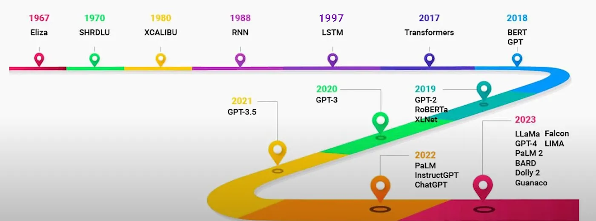
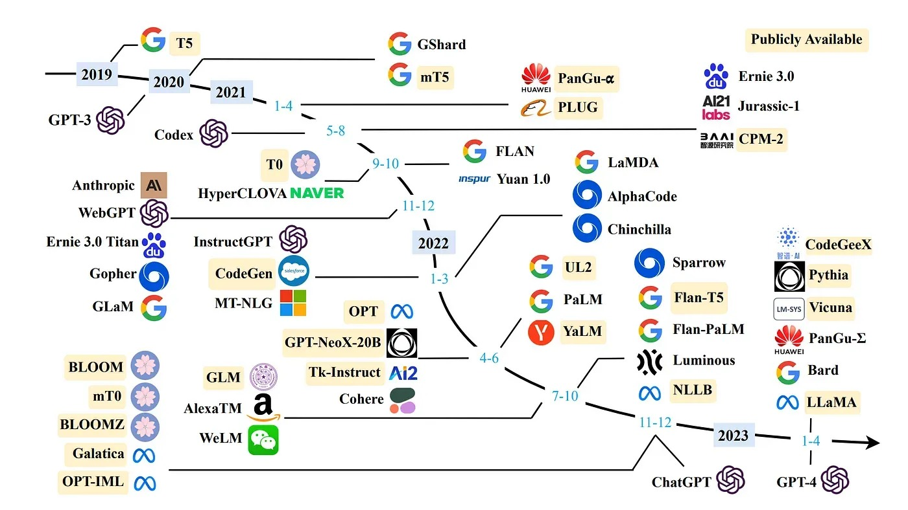
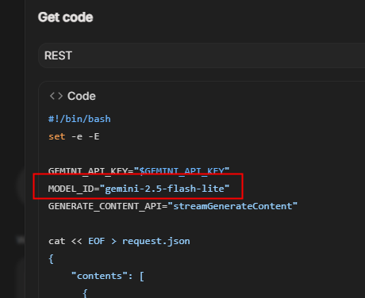

<style>
@import url('https://fonts.googleapis.com/css2?family=Prompt:ital,wght@0,100;0,300;0,400;0,700;1,100;1,300;1,400;1,700&display=swap');

    :root {
    font-family: Prompt;
    --hl-color: #D57E7E;
}
h1 {
  font-family: Prompt
}
</style>

# Information Technologies for Industrial Engineers

## เทคโนโลยีสารสนเทศสำหรับวิศวกรอุตสาหการ

---

# Natural Language Processing (NLP)

---

# What is NLP?

- A field of AI that makes human language intelligible to machines.
- NLP combines the power of linguistics and computer science to study the rules and structure of language.
- NLP creates intelligent systems capable of understanding, analyzing, and extracting meaning from text and speech.

---

# NLP tasks (applications)

- Semantic Analysis
  - Classify text by polarity of opinion (positive, negative, neutral).
- Named Entity Recognition (NER)
  - Extract entities from within a text (names, places, organizations, email addresses, etc).
- Text Classification
  - Classify text into predefined categories (tags).
- Text Translation
- Text prediction (answering, chatbot)

---

# Large Language Model

---

# LLM

- Most advanced `tool` for NLP today,
- General-purpose language processing models
  - Pre-trained on extensive datasets covering a wide range of topics.
  - Understand the fundamental structures and semantics of human language.
- `Large`
  - Substantial amount training data
  - Billions or even trillions of parameters

---

# History of NLP Technology/Tools



---

# Chatbots and rule-based systems (1960s)

- `ELIZA`
  - The first chatbot ever built by humans.
- It can create an illusion of a conversation
  - by rephrasing user statements as questions using pattern matching and substitution methodology.
- [Try it.](https://web.njit.edu/~ronkowit/eliza.html)

---

# Recurrent Neural Networks (1980s)

- Neural networks that can "remember" previous input.
  - Using feedback loop.
- Suitable for natural language processing (NLP) tasks.
- Still, they are not good at retaining memory and suffer from long term memory loss.
  - Vanishing gradient.

---

# Long Short Term Memory (1990s)

- Specialised type of RNN.
- Can remember information over long sequences.
- LSTM architecture
  - `input`, `forget`, `output` gates
  - These gates determined how much information should be memorised, discarded, or output at each step.

---

# Gated Recurrent Network (2010s)

- Designed to solve some of the same problems as LSTMs
  - but with a simple and more streamlined structure.
- GRUs architecture
  - `update` and `reset` gate
  - The reduced gating in GRUs made them more efficient in terms of computation.

---

# Attention Mechanism (2014)

- RNN based variants LSTM and GRU are not great at retaining the context when it was far away.
- Attention allows the model to look back to the entire source sequence dynamically
  - Selecting different parts based on their relevance at each step of the output.
- Performs much better especially in longer sequences.

---

# Transformers Architecture (2017)

- Architechture based on attention mechanism.
  - Stacked layers of (self) attention and feed-forward neural networks.
  - _Multi-head_ attention
- Can focus on different parts of the input sentence simultaneously, capturing various contextual nuances.
- Can sequences in parallel rather than sequentially.
- Foundation for a new era of LLMs.
  - `GPT` ➡️ _Generative Pre-Trained Transformer_

---

# Large Language Models (2018-onwards)

- Scaling...

---



---

# GPT-2

---

# GPT-2

- Released in 2019.
- Milestone in AI's ability to generate coherent and contextually relevant text.
- Trained on 40GB of internet text data and consists of 1.5 billion parameters.
- Can perform various NLP tasks such as text completion, translation, and summarization without task-specific training.

[More Info](https://dev.to/nareshnishad/gpt-2-and-gpt-3-the-evolution-of-language-models-15bh), [Model Source](https://huggingface.co/Xenova/distilgpt2)

---

# Setup

- `pnpm create vite@latest`
- ...
- `pnpm i @huggingface/transformers`
- `pnpm approve-builds`
  - Approve all packages.

---

# Setup

- [`./src/main.tsx`](https://github.com/it-for-ie-68/transformer-js/blob/text-generation-basic/src/main.tsx)
  - Remove css import.
- [`./index.html`](https://github.com/it-for-ie-68/transformer-js/blob/text-generation-basic/index.html)
  - Add `PicoCSS`

---

# Codes

- [`./src/model.ts`](https://github.com/it-for-ie-68/transformer-js/blob/text-generation-basic/src/model.ts)
- [`./src/App.tsx`](https://github.com/it-for-ie-68/transformer-js/blob/text-generation-basic/src/App.tsx)

---

# Problem

- UI hangup
- Reasons
  - Running heavy synchronous or async computations—like model loading and text generation—directly in the main thread
  - Blocking React's rendering and user interactions.

---

# Solution - Web Worker

- A type of JavaScript that runs in the background on a separate thread.
- Does not block the main thread that handles UI and user interactions.
  - Prevent UI freezes.
- The main thread communicates with the worker using message passing.

---

# Basic

- [`index.html`](https://github.com/it-for-ie-68/transformer-js/blob/web-worker-basic/index.html)
- [`script.js`](https://github.com/it-for-ie-68/transformer-js/blob/web-worker-basic/script.js)
- [`worker.js`](https://github.com/it-for-ie-68/transformer-js/blob/web-worker-basic/worker.js)

---

# Text-Generation Code

- [`./src/types.tsx`](https://github.com/it-for-ie-68/transformer-js/blob/text-generation-v1/src/types.ts)
- [`./src/App.tsx`](https://github.com/it-for-ie-68/transformer-js/blob/text-generation-v1/src/App.tsx)
- [`./src/worker.ts`](https://github.com/it-for-ie-68/transformer-js/blob/text-generation-v1/src/worker.ts)

---

# `SmolLM2-135M-Instruct`

- Part of the `SmolLM2` family
  - 135M parameters
  - Uses a transformer decoder architecture for text generation.
  - Trained on 2 trillion tokens from diverse datasets.
- Instruction-tuned for tasks like summarization, rewriting, question-answering, and conversational AI with prompt-based chat support.

[Model](https://huggingface.co/HuggingFaceTB/SmolLM2-135M-Instruct)

---

# `Phi-3.5-mini-instruct-onnx-web`

- State-of-the-art open language model with ONNX support

  - Enabling high efficiency and deployment in web environments.

- Built using synthetic and filtered web datasets
- Optimized for instruction-following and generative tasks like Q&A, coding, math, and reasoning.

[Model](https://huggingface.co/onnx-community/Phi-3.5-mini-instruct-onnx-web)

---

# Text-Translation

---

# `nllb-200-distilled-600M`

- Multilingual machine translation model based on a distilled variant of Meta’s `NLLB-200`,
- Translates single sentences between 200 languages.
- Utilizes a transformer architecture, distilled for efficiency and reduced resource usage compared to the original larger models.

---

# Text-Translation Code

- [`./src/types.tsx`](https://github.com/it-for-ie-68/transformer-js/blob/translation-v1/src/types.ts)
- [`./src/App.tsx`](https://github.com/it-for-ie-68/transformer-js/blob/translation-v1/src/App.tsx)
- [`./src/worker.ts`](https://github.com/it-for-ie-68/transformer-js/blob/translation-v1/src/worker.ts)

---

# Google Gimini

> Let's build an email generator for students who want to write to their advisors.

---

# You need this info.

```
API_KEY=
MODEL_ID=
```

---

# Get `API_KEY`

- Create a project in [Google Cloud Platform](https://cloud.google.com)
- Generate an API kep in [Google AI Studio](https://aistudio.google.com)

---

# Test Prompt: Model Settings

- [Gemini Model Comparison](https://ai.google.dev/gemini-api/docs/models)

- `System Instructions`
  - The writer is a female student. The tone should be formal.
- `Prompt`
  - Write an email to the advisor in Thai. The topic is [ขอพบ วันจันทร์ นี้ ตอน 10 โมง ว่างมั้ย อยากปรึกษาเรื่องโปรเจค].
- Adjust `temperature` for more randomness.

---

# Get `MODEL_ID`

- Click `Get Code`.
- Choose `REST`.
- Find the `MODEL_ID`.



---

# Setup Vite Project

- `pnpm create vite@latest`
- ...

---

# Setup

- `./.env`
  - Add `VITE_GEMINI_API_KEY=[API_KEY]` _(Change it)_
- [`./src/main.tsx`](https://github.com/it-for-ie-68/google-gemini/blob/main/src/main.tsx)
  - Remove css import.
- [`./index.html`](https://github.com/it-for-ie-68/google-gemini/blob/main/index.html)
  - Add `PicoCSS`

---

# Codes

- [`./src/model.ts`](https://github.com/it-for-ie-68/google-gemini/blob/main/src/model.ts)
  - Change your model on Line 2.
- [`./src/App.tsx`](https://github.com/it-for-ie-68/google-gemini/blob/main/src/App.tsx)
