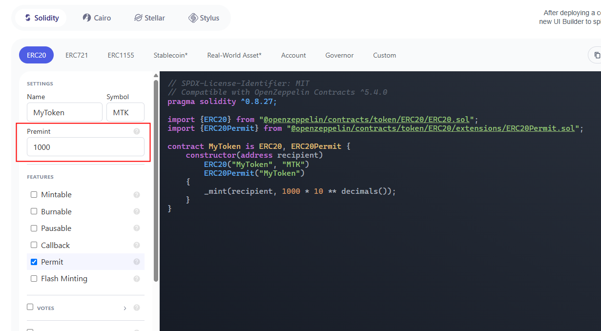

# Information Technologies for Industrial Engineers

## เทคโนโลยีสารสนเทศสำหรับวิศวกรอุตสาหการ

---

# Smart contract applications

---

# Decentralized lottery

---

# Decentralized lottery

- [Code](https://gist.github.com/nnnpooh/ea23ffda5f7f74dd6a6d46afb7b03ed3#file-lottery-sol)

- [Unit converter](https://coinguides.org/ethereum-unit-converter-gwei-ether/)

---

# ERC Token

---

# Example: LINK (Valuable)

- https://www.bitkub.com/th/market/link

---

# Example: LINK (No Value)

- Sepolia Testnet
  `0x779877A7B0D9E8603169DdbD7836e478b4624789`

- Base Sepolia
  `0xE4aB69C077896252FAFBD49EFD26B5D171A32410`

- Polygon Amoy
  `0x0Fd9e8d3aF1aaee056EB9e802c3A762a667b1904`

- Arbitrum Sepolia Testnet
  `0xb1D4538B4571d411F07960EF2838Ce337FE1E80E`

---

# What is a token?

- Something of value
  - Currency
  - Voting right
  - Stock
- Token standard
  - EIP (_Ethereum Improvement Proposal_)
    - Guideline
  - ERC (_Ethereum Request for Comments_)
    - Implementation

---

# Popular token standards

- **ERC-20**
  - Fungible tokens
  - Most used for representing currency
- **ERC-721**
  - Non-fungible tokens (NFTs)
  - Most used for representing digital artwork and collectibles
- **ERC-1155**
  - Multi-token standard
  - Combining the abilities of ERC-20 and ERC-720

---

# Timeline

[Source](https://www.leewayhertz.com/erc-20-vs-erc-721-vs-erc-1155/)

---

# Token list

- https://etherscan.io/tokens

---

# Let's make your own ERC-20 token.

- [Contract generator](https://wizard.openzeppelin.com)

- [Source code](https://github.com/OpenZeppelin/openzeppelin-contracts/blob/master/contracts/token/ERC20/ERC20.sol)

---

