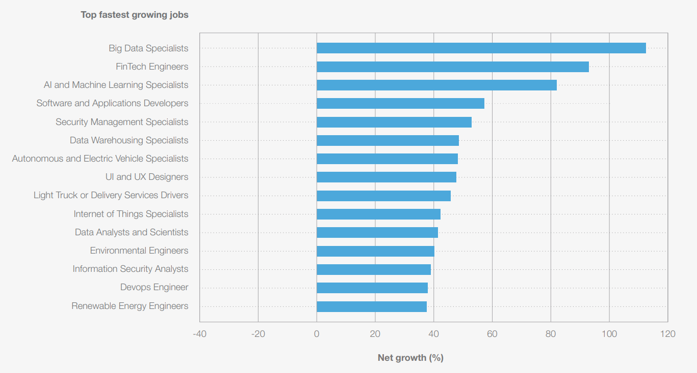

# Information Technologies for Industrial Engineers

---

# General Information

- **Course Number**: 255411
- **Course Name**: Information Technologies for Industrial Engineers
- **Semester**: 2569-1
- **Instructor**: Nirand Pisutha-Arnond

---

> What do you think about when you hear the word "Information Technologies"?

---

> What do you think about when you hear the word "Information Technologies"?

[Gemini Answer](https://share.google/aimode/FrpyT6wtuwQ2d0unN)

---

# My Experience

- I view myself as an _IT guy_.
  - I teach a course in Computer Engineering department.
  - I work in a software company.
  - I advise many software-related projects in Ministry of Industrial Promotion.

- However, I've never learned Information Technologies directly in school.
- I picked up the knowledge by trying to **build software**.
  - This process introduced me to many different technologies and concepts in Information Technologies.

---

# What I like about being an IT guy

- I feel that I understand how computers work and how to make them work for me.
- I have more tools to help me solve problems.
- It is a basis for the fastest growing jobs according to the World Economic Forum.

---

# The Future of Jobs Report 2025

_Source: [World Economic Forum, 2025.](https://www.weforum.org/publications/the-future-of-jobs-report-2025/in-full/)_

---

# Motivation

- Instead of teaching you the theory of Information Technologies, I will teach you how to **build software**.
- This will expose you to many different technologies and concepts in Information Technologies.

---

# After this class you will be able to

1. Develop and deploy _fullstack_ application with current software technology
2. Select appropriate technology stack for IT-related problems.

---

# Grading

| Evaluation Criteria | Weight |
| :-----------------: | :----: |
|       Midterm       |  20%   |
|        Final        |  20%   |
|     Assignments     |  60%   |

_Assignments will consists of 5-6 small projects._

---

# Course Outline

> Fullstack = Frontend + Backend + Deployment

---

# Frontend technology

- HTML
- CSS
- JavaScript
- TypeScript

---

# Backend technology

- Node.js
- Express.js
- Database

---

# Deployment

- Linux (server administration)
- Docker

---

# Extra

If time permits, we _may_ cover

- LLM (Large Language Model) and AI (Artificial Intelligence) in the context of web application development.
- Blockchain and Web3 in the context of web application development.

---

# Fullstack Developer Roadmap

[Do not panic!](https://roadmap.sh/full-stack)

---

# Using AI

- The goal of this course to expose you to the current software technology.
  - Not to make you a professional software engineer.
- Therefore, it is okay to use AI tools to assist your coding.
- However, the more you outsource your tasks to AI, the less you will learn. So, use it wisely.

---

# Using AI

- Bad way to use AI
  - Use it to code you something you don’t understand very well.

- Good way to use AI
  - Use it like a better Google + Stack Overflow.
  - Use it like a code reviewer to help you find mistakes in your code.

---

# Assignment

- You will asked to explain your code in the VDO along with your submission.
- This encourages you to understand your code and not just copy-paste from AI.

---

# Lets get started

---

# Tools

- **Terminal**
  - Windows - PowerShell 7 + Chocolatey [(Setup Guide)](https://github.com/it-for-ie-69/lectures/blob/main/src/T01_intro/windows.md)
  - MacOS - Zsh + Homebrew
- **Editor: VSCode**
  - Enable: Format on save
  - Extension: Prettier
  - Extension: Auto Rename Tag
