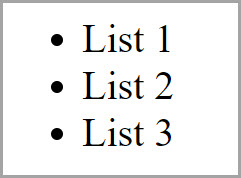
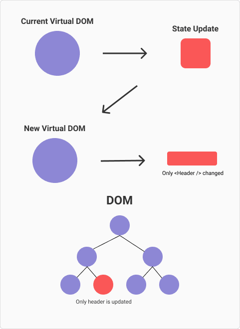

<style>
@import url('https://fonts.googleapis.com/css2?family=Prompt:ital,wght@0,100;0,300;0,400;0,700;1,100;1,300;1,400;1,700&display=swap');

    :root {
    font-family: Prompt;
    --hl-color: #D57E7E;
}
h1 {
  font-family: Prompt
}
</style>

# Information Technologies for Industrial Engineers

## เทคโนโลยีสารสนเทศสำหรับวิศวกรอุตสาหการ

---

# JavaScript Frameworks

---

# What is a framework?

- A framework is a library that offers **opinions** about how software gets built.
- These opinions allow for **predictability** and **homogeneity** in an application.
  - Predictability allows software to scale to an enormous size and still be maintainable.
  - Predictability and maintainability are essential for the health and longevity of software.

---

# Imperative and declarative programming

- **Imperative**
  - Tell a computer how to do something.
- **Declarative**
  - Describe to a computer what you want.

---

# To do this



---

# Imperative programming

- JavaScript

```javascript
const ul = document.createElement("ul");
for (let i = 1; i < 4; i++) {
  const li = document.createElement("li");
  li.textContent = `List ${i}`;
  ul.appendChild(li);
}
document.body.appendChild(ul);
```

---

# Declarative

- Just use HTML

```html
<ul>
  <li>List 1</li>
  <li>List 2</li>
  <li>List 3</li>
</ul>
```

---

# But...

- `HTML` only works for static site.
- For dynamic web application, a **framework** can help us write code more **declaratively**.

---

# Vanilla JS or Framework?

- Vanilla JS
  - A less complex site, for example a personal to-do list or a site that displays mostly static content
- Framework
  - A large site with a complex UI. Frameworks provide solutions to common problems that would take an absurd amount of time and patience to implement with pure JavaScript.

---

# Framework popularity

- [State of JS 2025](https://2025.stateofjs.com/en-US/libraries/front-end-frameworks/)
- [Stack Overflow Survey 2025](https://survey.stackoverflow.co/2025/technology#1-web-frameworks-and-technologies)

---

# Vue

---

# Vue Template Syntax

```vue
<template>
  <h1>Hello, world!</h1>
</template>
```

- Vue uses template syntax to describe UI declaratively.
- Directives such as `v-if`, `v-for`, and `v-bind` connect data to the DOM.
- This syntax is compiled into efficient render functions.
- [Source](https://vuejs.org/guide/essentials/template-syntax.html)

---

# Virtual DOM

- Virtual DOM (VDOM) represents the DOM tree in memory.
- VDOM performs calculations and decides which elements of the actual DOM should be mutated.
  - Faster performance.
- [Source](https://vuejs.org/guide/extras/rendering-mechanism.html)



---

# Vue Single-File Component (SFC)

```js
<script setup lang="ts">
import { ref } from "vue";

const count = ref(0);
</script>

<template>
  <button @click="count++">Count: {{ count }}</button>
</template>
```

---

# Rendering process

- Rendering is triggered when reactive state changes in your application.
- Vue tracks dependencies and updates only the affected parts of the DOM.
- See illustration in [Source](https://vuejs.org/guide/extras/rendering-mechanism.html).

---

# Vue Reactivity Flow

- User action updates reactive state (`ref` / `reactive`)
- Vue re-runs dependent render logic
- DOM is patched efficiently via Virtual DOM diffing

```text
Event -> State Change -> Re-render -> DOM Patch
```

---

# Get started with `vue`

- `pnpm create vite@latest`
  - `Project name`: my-app (any name)
  - `Select a framework`: Vue
  - `Select a variant`: TypeScript
- `cd my-app`
- `code . -r` _(Set VSCode workspace)_
- `pnpm install`
- `pnpm run dev`

---

# Build

- `pnpm run build`

# Preview

- `pnpm run preview`

---

# Optional

- If you want to preview the build with `live server` you need to set this setting in `vite.config.ts`.

```js
import { defineConfig } from 'vite'
import vue from '@vitejs/plugin-vue'

export default defineConfig({
  plugins: [vue()],
  base: "./", 👈
});
```

- Then run `pnpm run build`.

---

# Deploy

- Deploy `./dist` folder to Netlify.

---

# Online IDE

- https://codesandbox.io/
