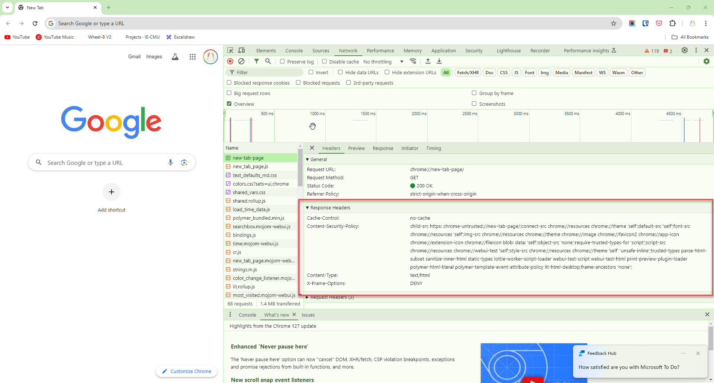

<style>
@import url('https://fonts.googleapis.com/css2?family=Prompt:ital,wght@0,100;0,300;0,400;0,700;1,100;1,300;1,400;1,700&display=swap');

    :root {
    font-family: Prompt;
    --hl-color: #D57E7E;
}
h1 {
  font-family: Prompt
}
img {
  border-radius: 0.5rem; 
}
</style>

# Information Technologies for Industrial Engineers

---

# Data Fetching

---

# Get external data

- Let say we want to display this data on our app.
  - https://jsonplaceholder.typicode.com/todos
- You can use `fetch`.

---

# `fetch` API

- The Fetch API is a modern interface that allows you to make HTTP requests to servers from web browsers.
- The `fetch()` method is available in the global scope that instructs the web browsers to send a request to a URL.
- Let's `fetch` information from [JSON Placeholder API](https://jsonplaceholder.typicode.com/todos)

---

# `fetch`

```js
fetch("https://jsonplaceholder.typicode.com/todos");
```

- The `fetch()` method returns a `Promise`.
- But what is a **Promise**?

---

# Note

- If you cannot run console script, it could be because the website have a content security policy header.
- The best way is to create a blank `index.html` and run it yourself.
  

---

# `Promise`

- A `Promise` is an object that represents an intermediate state of an operation.
- `Promise` tells you that a result of some kind will be returned at some point in the future.
- You have to write code that will be executed in order to do something else with a successful result, or to gracefully handle a failure case.
  c

---

# Responding to `Promise`

```javascript
fetch("https://jsonplaceholder.typicode.com/todos")
  .then((res) => {
    return res.json();
  })
  .then((todos) => {
    return console.log(todos);
  });
```

---

# Shorter syntax

```javascript
fetch("https://jsonplaceholder.typicode.com/todos")
  .then((res) => res.json())
  .then((todos) => console.log(todos));
```

---

# Displaying todo titles

```js
fetch("https://jsonplaceholder.typicode.com/todos")
  .then((res) => {
    return res.json();
  })
  .then((todos) => {
    const body = document.body;
    for (let i = 0; i < todos.length; i++) {
      const div = document.createElement("div");
      div.innerText = todos[i].title;
      body.appendChild(div);
    }
  });
```

---

# Note

- Promise creates a new execution context.
- You cannot access variables outside of the `Promise` execution context.

This will not work:

```js
let todos;
fetch("https://jsonplaceholder.typicode.com/todos")
  .then((res) => res.json())
  .then((data) => {
    todos = data;
  });
console.log(todos); // undefined
```

---

# Why is `todos` undefined?

- The `fetch` function is asynchronous.
  - It does not block the execution of the code that follows it.
- When you call `fetch`, it initiates the request and immediately moves on to the next line of code without waiting for the response.
- As a result, when you try to log `todos` immediately after the `fetch` call, the request has not yet completed, and `todos` remains undefined.

---

# Fetching data in Vue.js

---

# The code in `script` section

- The cocde in the script section is executed when the component is created.
- This is a good place to fetch data from an API.

---

# Dummy data

- For testing outputting JSX.

```ts
const todos = [
  {
    userId: 1,
    id: 1,
    title: "delectus aut autem",
    completed: false,
  },
  {
    userId: 1,
    id: 2,
    title: "quis ut nam facilis et officia qui",
    completed: false,
  },
];
```

---

# Full example

https://github.com/it-for-ie-69/vue-data-fetching/blob/main/src/App.vue
