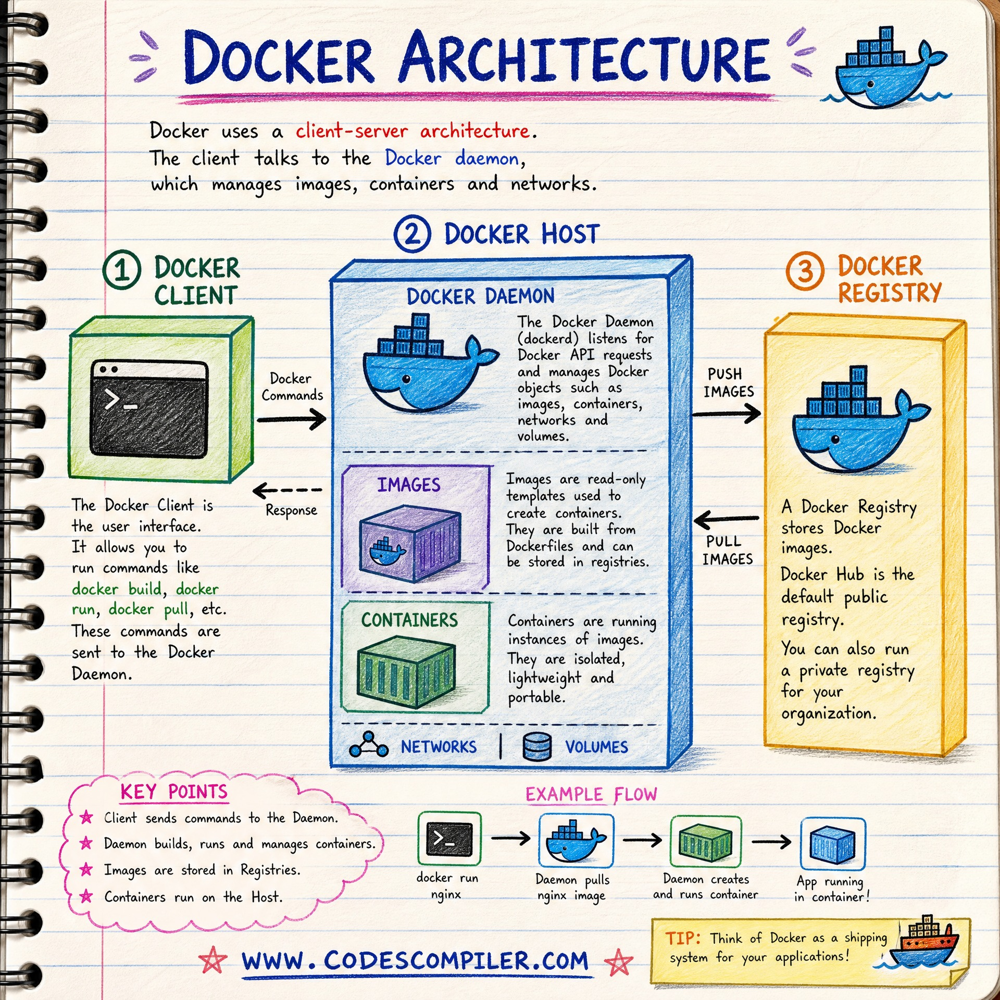

<style>
@import url('https://fonts.googleapis.com/css2?family=Prompt:ital,wght@0,100;0,300;0,400;0,700;1,100;1,300;1,400;1,700&display=swap');

    :root {
    font-family: Prompt;
    --hl-color: #D57E7E;
}
h1 {
  font-family: Prompt
}
img {
  border-radius: 0.5rem; 
}
</style>

# Information Technologies for Industrial Engineers

---

# Docker and Self Hosted Database

---

# Why Self Hosted Database?

- Control over data and security
- Customization and flexibility
- Cost-effective in the long run
- No dependency on third-party services

---

# How to Self Host?

- Choose a database software (e.g., MySQL, PostgreSQL, MongoDB)
- Set up a server (local machine, cloud server, or dedicated server)
- Install the database software
- Configure the database settings (user accounts, permissions, etc.)
- Create and manage databases and tables

---

# Installing method

- Native installation
- **Docker container**

---

# Native Installation

- You do this as if you want to install another software on your computer. You can download the installer from the official website and follow the installation instructions.
- This method is easier to get started.
- However, your environment is not isolated, and it may cause conflicts with other software or dependencies.
  - _"Works on my computer, but not on yours."_
- This is not recommended for production use.
  - Docker is a better option for production use.

---

# What is Docker?

- Docker is a platform (and company) that allows you to package and run applications in isolated environments called **containers**.

---

# What is a Container?

- A container is a lightweight, standalone, and executable package that includes everything needed to run an application: code, runtime, system tools, libraries, and settings.
- Containers are **isolated** from each other and the host system, ensuring that they run consistently across different environments.
- You can think about container as another computer that runs on your computer.
  - It has its own operating system, file system, and network stack.

---



---

Source: https://www.instagram.com/p/Dapjgh9jR95/

---

# Docker Vocabulary

- **Image**: A read-only template that contains the application and its dependencies. Images are used to create containers.
- **Container**: A running instance of an image. Containers are isolated from each other and the host system.
- **Registry**: A storage and distribution system for Docker images. Docker Hub is the default public registry, but you can also use private registries.
- **Client**: The command-line interface (CLI) tool used to interact with the Docker daemon. The CLI allows you to build, run, and manage containers and images.

---

# Get started with Docker

- Install Docker Desktop (Windows, macOS) or Docker Engine (Linux)
  - https://www.docker.com/products/docker-desktop/
  - `choco install docker-desktop` (Windows)
  - `brew install --cask docker` (macOS)

---

# Docker Requirements

- 8 Gb of RAM (4 GB minimum)
- 6 GB of free disk space
- Ensure Hardware Virtualization is enabled in your BIOS/UEFI (usually enabled by default on modern laptops).
- (Windows) `"Use WSL 2 instead of Hyper-V"`
- (Mac) Download the correct installer based on your chip (Apple Silicon or Intel).

---

# Hello World with Docker

- Run the following command to check if Docker is installed correctly:

```bash
docker run hello-world
```

- The `hello-world` image is a simple image that prints a message to the console. If you see the message, it means Docker is working correctly.
- Visit https://hub.docker.com/_/hello-world to learn more about the `hello-world` image.

---

# Web-server with Docker

```
docker run -d -p 8080:80 nginxdemos/hello
```

- The `-d` flag runs the container in detached mode (in the background).
- The `-p` flag maps port 8080 on the host to port 80 in the container.
- You can access the web server by opening your browser and going to http://localhost:8080.
- You can also change the html file in "/usr/share/nginx/html" in the container.

---

# Node.js with Docker

```
docker run -d -p 5173:5173 node:lts-alpine sleep infinity
```

- The `sleep infinity` command keeps the container running indefinitely, allowing you to interact with it.
  - Without this command, the container would exit immediately after starting, as there would be no process to keep it alive.

---

# Run Vite Project in Docker

- `npm install -g pnpm`
- `pnpm create vite@latest`
- `cd vite-project`
- `pnpm dev --host 0.0.0.0`

> Without the `--host 0.0.0.0` option, the Vite development server would only be accessible from within the container, and you wouldn't be able to access it from your host machine.

---

# Docker Commands

- `docker ps` - List running containers
- `docker ps -a` - List all containers (running and stopped)
- `docker images` - List all images
- `docker stop <container_id>` - Stop a running container
- `docker start <container_id>` - Start a stopped container
- `docker image rm <image_id>` - Remove an image

---

# Useful Utilities

- `docker image prune` - Remove unused images
- `docker container prune` - Remove stopped containers
- `docker volume prune` - Remove unused volumes
- `docker system prune` - Remove unused data (images, containers, volumes, networks)

---

# Database with Docker (PostgreSQL)

---

- Windows

```powershell
docker run -d `
  --name my-postgres `
  -e POSTGRES_PASSWORD=1234 `
  -v pgdata:/var/lib/postgresql `
  -p 5432:5432 `
  postgres:latest
```

- Mac

```powershell
docker run -d \
  --name my-postgres \
  -e POSTGRES_PASSWORD=1234 \
  -v pgdata:/var/lib/postgresql \
  -p 5432:5432 \
  postgres:latest
```
