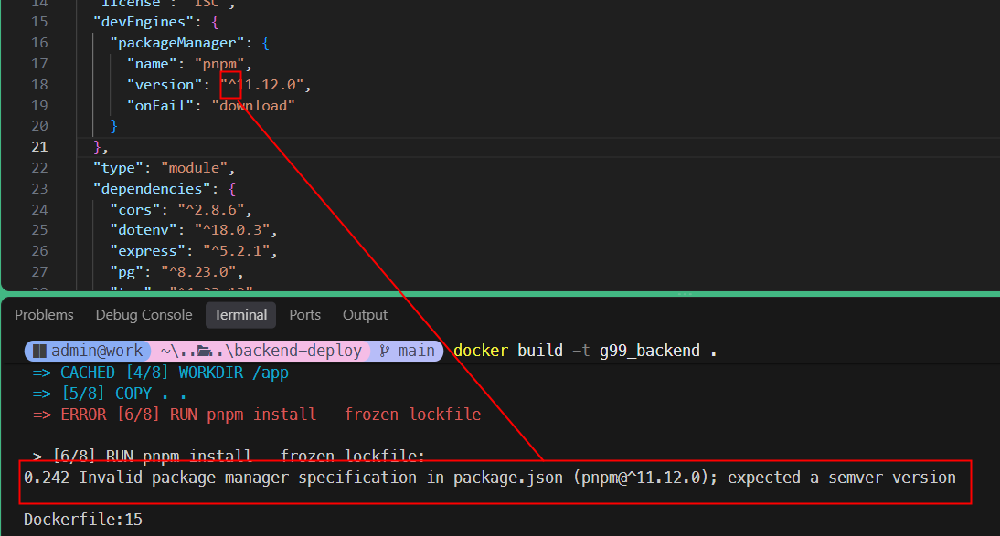

<style>
@import url('https://fonts.googleapis.com/css2?family=Prompt:ital,wght@0,100;0,300;0,400;0,700;1,100;1,300;1,400;1,700&display=swap');

    :root {
    font-family: Prompt;
    --hl-color: #D57E7E;
}
h1 {
  font-family: Prompt
}
img {
  border-radius: 0.5rem; 
}
</style>

# Information Technologies for Industrial Engineers

---

# Deployment

---

# Goal

- We will containerize the backend and frontend applications using Docker and deploy them to a server.
- On the server we will use Linux without GUI.
  - No `Dbeaver`, no `Docker Desktop`, no mouse.
- Terminal
  - `Windows` - `Git Bash`
  - `Mac` - `Terminal`

---

# Git Bash Tip

- To paste commands
  - Right click to paste
  - `Shift + Insert` to paste
- Another way is to use VSCODE terminal with `Git Bash` as the default shell.
  - You can use the normal `Ctrl + V` to paste commands.

---

# Database

- Define the following environment variables in your terminal:

```bash
DB_CONTAINER_NAME='g99_db'
DB_VOLUME_NAME='g99_volume'
DB_PASSWORD='6&zi9!%BYCUZo6B'
DB_PORT='4099'
```

- Create a container

`docker run -d --name ${DB_CONTAINER_NAME} -e POSTGRES_PASSWORD=${DB_PASSWORD} -v ${DB_VOLUME_NAME}:/var/lib/postgresql -p ${DB_PORT}:5432 postgres:latest`

> Note that the volume ${DB_VOLUME_NAME} is automatically created.

---

# Database

- Inspect the running container
  `docker ps -a`
- Delete the container and volume if you want to start over
  `docker rm -f ${DB_CONTAINER_NAME}`
  `docker volume rm ${DB_VOLUME_NAME}`

---

# Connect to Database

We will use `psql` to create a database and a table. Think about `psql` as `Dbeaver`.

- Go into the container
  `docker exec -it ${DB_CONTAINER_NAME} bash`
- Connect to the database
  `psql -U postgres`

---

# Create Database

- Create a database
  `CREATE DATABASE app_db;`
- Check the database
  `\l`
- Connect to the database
  `\c app_db`
- Check connection
  `\conninfo`

---

# Create Table

- Create table

```sql
CREATE TABLE IF NOT EXISTS
  todos (
    id serial PRIMARY KEY,
    title VARCHAR(50) NOT NULL,
    completed BOOLEAN NOT NULL DEFAULT FALSE,
    created_at TIMESTAMPTZ NOT NULL DEFAULT NOW()
  );
```

- Check the table
  `\dt` or `SELECT * FROM todos;`

---

# Exit

- Exit `psql`
  `\q`
- Exit the container
  `exit`

---

# Common Mistakes in `psql`

- Forget `;` at the end of the command.
  - ❌ `CREATE DATABASE app_db`
  - ✅ `CREATE DATABASE app_db;`
- Use `/` instead of `\` for commands.
  - ❌ `/l`
  - ✅ `\l`
- Forget to connect to the database before creating a table.
  - ❌ `CREATE TABLE todos ...`
  - ✅ `\c app_db` then `CREATE TABLE todos ...`

---

# Backend Starter

> Make sure you use 'Git Bash' on VSCODE terminal.

- `git clone https://github.com/it-for-ie-69/backend-deploy`
- `cd backend-deploy`
- `git init` (Optional)
- Create `.env` file from `.env.example` and set the database password to your own password.
- `pnpm i`
- `pnpm run dev`

---

```bash
BACKEND_IMAGE_NAME='g99_backend'
```

`docker build -t ${BACKEND_IMAGE_NAME} .`

---

```bash
BACKEND_IMAGE_NAME='g99_backend'
BACKEND_PORT=5099

PGUSER=postgres
PGHOST=g99_db
PGDATABASE=app_db
PGPASSWORD='6&zi9!%BYCUZo6B'
PGPORT=4099
```

`docker run -d --name ${BACKEND_IMAGE_NAME} -p ${BACKEND_PORT}:3000 -e PGUSER=${PGUSER} -e PGHOST=${PGHOST} -e PGDATABASE=${PGDATABASE} -e PGPASSWORD=${PGPASSWORD} -e PGPORT=${PGPORT} -e DB_USER="admin" -e DB_PASS="secret" ${BACKEND_IMAGE_NAME}`

---

# Corepack Semver Error


