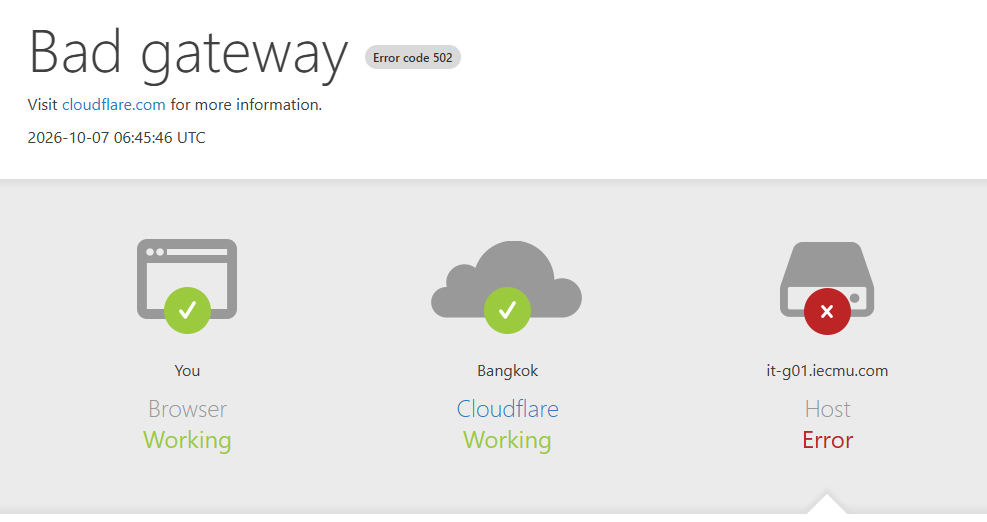
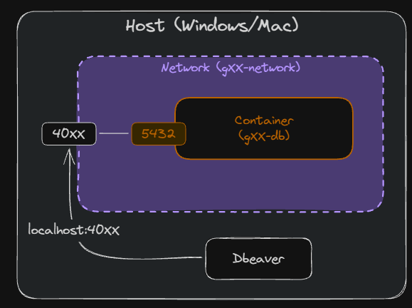
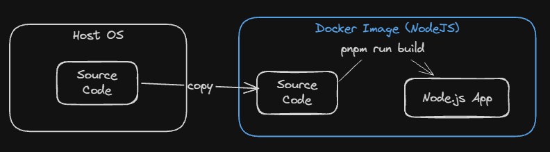
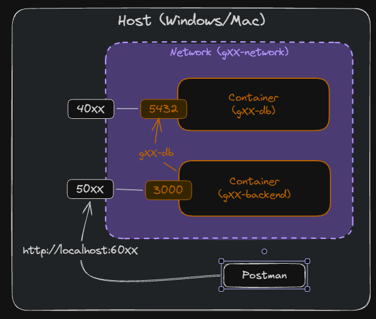
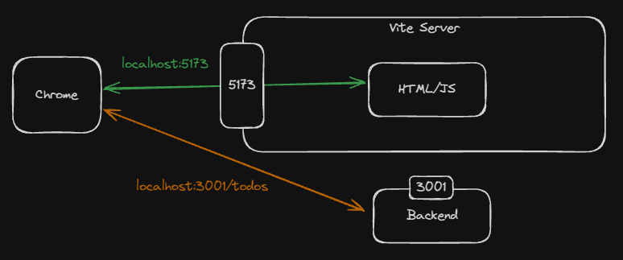
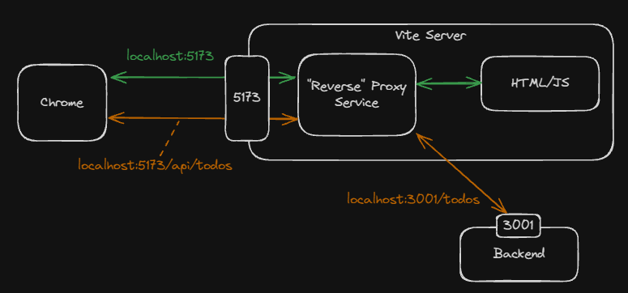
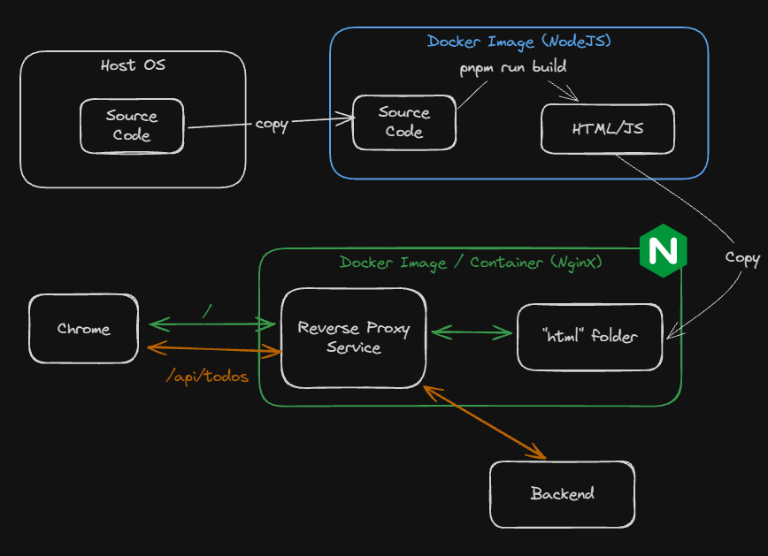
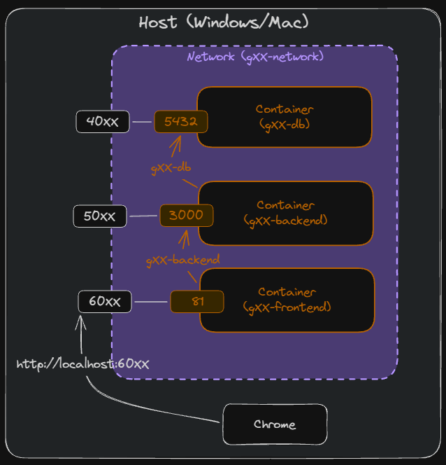
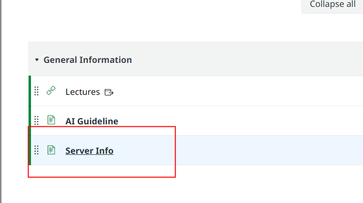

<style>
@import url('https://fonts.googleapis.com/css2?family=Prompt:ital,wght@0,100;0,300;0,400;0,700;1,100;1,300;1,400;1,700&display=swap');

    :root {
    font-family: Prompt;
    --hl-color: #D57E7E;
}
h1 {
  font-family: Prompt
}
img {
  border-radius: 0.5rem; 
}
</style>

# Information Technologies for Industrial Engineers

---

# Deployment

---

# Motivation

- Take a look at [this.](https://docs.google.com/spreadsheets/d/1Cl5uFgnDi7Url3osVAWpl23K3f7Dquh-P0hhYr8zsIE/edit)
- There is a public URL preassigned to you, but it does not work yet.
- By the end of this class, your url will work.



---

# How it works.

- When you type the url in web browser, the url forward the request to a private server that I setup.
- My server expects an application running at a specific port.
- Your job is to run your application at that specific port.
  - Your `Frontend Port`, to be specific.

---

# Goal

- We will use our `node.js` backend and `Vue.js` frontend applications that we have developed.
  - However, in the server there is no `node.js` installed. So we cannot use `pnpm run ...` in the server, not directly.
- The solution is to **containerize** the backend and frontend applications using `Docker` and deploy them to a server.

> _One nice thing about docker is that we can test all the steps in our local machine before deploying to the server. The steps are the same and it works 99% of the time._

---

# Requirements

- On the server we will use Linux without GUI.
  - No `Dbeaver`, no `Docker Desktop`, no mouse.
- Terminal to test on local machine
  - `Windows` - `Git Bash`
  - `Mac` - `Terminal`
- Tips: to paste commands in `Git Bash`
  - Right click to paste
  - `Shift + Insert` to paste

---

# Variable in Bash

- Define a variable
  `MY_VARIABLE='Hello World'`
- Inspect the variable
  `echo ${MY_VARIABLE}`
- Interpolate the variable in a command
  `echo "The message is: ${MY_VARIABLE}"`

> Notice the single quote `'` and double quote `"` difference. Single quote will not interpolate the variable.

---

# Dockerhub

- We will push the backend/frontend images to Dockerhub so that we can pull it from the server.
- Create an account at https://hub.docker.com.
- Create two repositories called `gXX_backend_image` and `gXX_frontend_image`.
  - Check your group name [here.](https://docs.google.com/spreadsheets/d/1Cl5uFgnDi7Url3osVAWpl23K3f7Dquh-P0hhYr8zsIE/edit)
- Login to your account in terminal
  - `docker login`

---

# Step 1

> Preparing Docker Environment

---

```bash
DOCKER_VOLUME_NAME='gXX_volume'
DOCKER_NETWORK_NAME='gXX_network'
```

- Create volume
  `docker volume create ${DOCKER_VOLUME_NAME}`
- List the volume
  `docker volume ls`
- Create network
  `docker network create ${DOCKER_NETWORK_NAME}`
- List the network
  `docker network ls`

---

# Why Network?

- The backend container needs to connect to the database container.
  - The url is no longer `localhost` because the backend container is running in a different container than the database container.
  - This is like a separate computer connecting to a database server.
- Without a network
  - We need the **IP address** of the database container.
  - Unstable -> IP changes every time we restart the container.
- With a network
  - We use the **container name** as the hostname
  - Stable

---

# Step 2

> Database

---

# Create Database

```bash
DB_IMAGE_NAME='postgres:latest'
DB_CONTAINER_NAME='gXX_db'
DB_PASSWORD='6&zi9!%BYCUZo6B'
DB_PORT='40XX'
```

- Create a container

`docker run -d --name ${DB_CONTAINER_NAME} -e POSTGRES_PASSWORD=${DB_PASSWORD} -v ${DOCKER_VOLUME_NAME}:/var/lib/postgresql --network ${DOCKER_NETWORK_NAME} -p ${DB_PORT}:5432 ${DB_IMAGE_NAME}`

---

# Explanation for the command

| Option             | Description                                    |
| ------------------ | ---------------------------------------------- |
| `-d`               | Run the container in detached mode             |
| `--name`           | Assign a name to the container                 |
| `-e`               | Set environment variables in the container     |
| `-v`               | Mount a volume to the container                |
| `--network`        | Connect the container to a network             |
| `-p`               | Publish a container's port to the host         |
| `${DB_IMAGE_NAME}` | The name of the image to use for the container |

---

# DB Container Management

- Inspect the list of container
  `docker ps -a`
- Insepct the container
  `docker inspect ${DB_CONTAINER_NAME}`
- Delete the container, volume, and network if you want to start over
  `docker rm -f ${DB_CONTAINER_NAME}`
  `docker volume rm ${DOCKER_VOLUME_NAME}`
  `docker network rm ${DOCKER_NETWORK_NAME}`

---

# Connection to Database

We will use `psql` to create a database and a table. Think about `psql` as `Dbeaver`.

- Go into the container
  `docker exec -it ${DB_CONTAINER_NAME} bash`
- Connect to the database
  `psql -U postgres`

---

# Create Database

- Create a database
  `CREATE DATABASE app_db;`
- Check the database
  `\l`
- Connect to the database
  `\c app_db`
- Check connection
  `\conninfo`

---

# Create Table

- Create table

```sql
CREATE TABLE IF NOT EXISTS
  todos (
    id serial PRIMARY KEY,
    title VARCHAR(50) NOT NULL,
    completed BOOLEAN NOT NULL DEFAULT FALSE,
    created_at TIMESTAMPTZ NOT NULL DEFAULT NOW()
  );
```

- Check the table
  `\dt` or `SELECT * FROM todos;`

---

# Exit

- Exit `psql`
  `\q`
- Exit the container
  `exit`

---

# Common Mistakes in `psql`

- Forget `;` at the end of the command.
  - ❌ `CREATE DATABASE app_db`
  - ✅ `CREATE DATABASE app_db;`
- Use `/` instead of `\` for commands.
  - ❌ `/l`
  - ✅ `\l`
- Forget to connect to the database before creating a table.
  - ❌ `CREATE TABLE todos ...`
  - ✅ `\c app_db` then `CREATE TABLE todos ...`

---

# Mental Picture



---

# Step 3:

> Backend Application

---

# Backend Starter

- `git clone -b starter https://github.com/it-for-ie-69/backend-deploy.git`
- Open VSCode and open the folder `backend-deploy`.
- Create `.env` file from `.env.example` and set the database password to your own password.
- `pnpm i`
- `pnpm run dev`
- `pnpm run build`

> Visit `http://localhost:3000/todos` to check. Also note that this backend always use port 3000.

---

# Prepare Backend for Docker Build

- Create `Dockerfile` [(Link)](https://github.com/it-for-ie-69/backend-deploy/blob/main/Dockerfile)
  - This is the recipe to build the backend image.
- Create `.dockerignore` [(Link)](https://github.com/it-for-ie-69/backend-deploy/blob/main/.dockerignore)
  - This is the list of files and folders that we don't want to include in the image.

---

# Build Process (Diagram)



---

# Build Backend Image

```bash
BACKEND_IMAGE_NAME="gXX_backend_image"
```

- Build the image
  `docker build --platform linux/amd64 -t ${BACKEND_IMAGE_NAME} .`
- Check the image
  `docker images`
- Remove the image if you want to start over
  `docker rmi ${BACKEND_IMAGE_NAME}`

---

# Test Run Backend Container

```bash
BACKEND_CONTAINER_NAME='gXX_backend'
BACKEND_PORT='50XX'

# These are the env from the .env file that we need to pass to the container
PGUSER='postgres'
PGHOST=${DB_CONTAINER_NAME}
PGDATABASE='app_db'
PGPASSWORD=${DB_PASSWORD}
PGPORT='5432'
```

`docker run -d --name ${BACKEND_CONTAINER_NAME} -p ${BACKEND_PORT}:3000 --network ${DOCKER_NETWORK_NAME} -e PGUSER=${PGUSER} -e PGHOST=${PGHOST} -e PGDATABASE=${PGDATABASE} -e PGPASSWORD=${PGPASSWORD} -e PGPORT=${PGPORT} ${BACKEND_IMAGE_NAME}`

---

# Note: DB Connection

Consider this setup

```bash
PGHOST=${DB_CONTAINER_NAME} # i.e. gXX_db
PGPORT=5432
```

- The host is no longer `localhost` because the backend container is running in a different container than the database container.
- The port is no longer `40XX` because the backend container is connecting to the database container directly, not through the host machine.

---

# Note: Port

```bash
${BACKEND_PORT}:3000 // i.e. 50XX:3000
```

- The backend container is listening to port `3000` inside the container (hardcoded).
- The backend container is listening to port `50XX` outside the container (on the host machine).

---

# Mental Picture



---

# Push Backend Image to Dockerhub

```bash
BACKEND_IMAGE_NAME_TAG='dockerhub_userXXX/gXX_backend_image:latest'
```

- Tag the image
  `docker tag ${BACKEND_IMAGE_NAME} ${BACKEND_IMAGE_NAME_TAG}`
- Push command
  `docker push ${BACKEND_IMAGE_NAME_TAG}`

---

# Test Running Container from Dockerhub

- `docker rm -f ${BACKEND_CONTAINER_NAME}`
- `docker image rm ${BACKEND_IMAGE_NAME} ${BACKEND_IMAGE_NAME_TAG}`
- `docker run -d --name ${BACKEND_CONTAINER_NAME} -p ${BACKEND_PORT}:3000 --network ${DOCKER_NETWORK_NAME} -e PGUSER=${PGUSER} -e PGHOST=${PGHOST} -e PGDATABASE=${PGDATABASE} -e PGPASSWORD=${PGPASSWORD} -e PGPORT=${PGPORT} ${BACKEND_IMAGE_NAME_TAG}`

> Note the difference between `${BACKEND_IMAGE_NAME}` and `${BACKEND_IMAGE_NAME_TAG}`. The first one is the local image, the second one is the image from Dockerhub.

---

# Step 4:

> Frontend Application

---

# Starter

- `git clone -b starter https://github.com/it-for-ie-69/frontend-deploy.git`
- Open VSCode and open the folder `frontend-deploy`.
- Create `.env` file from `.env.example` and set the backend url to your own backend url.
- `pnpm i`
- `pnpm run dev`
- `pnpm run build`

---

# Build Error

- You will see error from TypeScript compiler when you run `pnpm run build`.
- Change the `package.json` file

```json
"build": "vue-tsc -b && vite build",
```

to

```json
"build": "vite build",
```

---

# Problem with Current Frontend Build

- Right now if you inspect `./dist/assets/index-*.js` you will see that the `baseURL` is hardcoded to `http://localhost:50XX` or similar.
- This does not work when we build the frontend container and run it in a different machine.
- We need to make the `baseURL` configurable so that we can set it to the backend container url when we run the frontend container.

---

# Solution

- Make proxy server by modifying `vite.config.ts` [(Link)](https://github.com/it-for-ie-69/frontend-deploy/blob/main/vite.config.ts)
  - This config is used to forward the request to the backend container.
- Change `App.vue` to use the configurable `baseURL`.

```js
const baseURL = "/api";
```

- Check if your apps runs/build correctly
  - `pnpm run dev`
  - `pnpm run build`

> In production, we will use `Nginx` instead of the development proxy server to forward the request to the backend container.

---

# Without Proxy Server



---

# With Proxy Server



---

# Prepare Frontend for Docker Build

- Create `Dockerfile` [(Link)](https://github.com/it-for-ie-69/frontend-deploy/blob/main/Dockerfile)
- Create `.dockerignore` [(Link)](https://github.com/it-for-ie-69/frontend-deploy/blob/main/.dockerignore)
- Create `nginx.conf.template` [(Link)](https://github.com/it-for-ie-69/frontend-deploy/blob/main/nginx.conf.template)
  - This is the Nginx configuration file that will be used to forward the request to the backend container.
  - The `${NGINX_PROXY_PASS}` will be replaced with the backend container url when we run the frontend container.

---

# Build Process (Diagram)



---

# Build Frontend Image

```bash
FRONTEND_IMAGE_NAME='gXX_frontend_image'
```

- Build the image
  `docker build --platform linux/amd64 -t ${FRONTEND_IMAGE_NAME} .`
- Check the image
  `docker images`
- Remove the image if you want to start over
  `docker rmi ${FRONTEND_IMAGE_NAME}`

---

# Test Run Frontend Container

```bash
FRONTEND_CONTAINER_NAME='gXX_frontend'
FRONTEND_PORT='60XX'
BACKEND_URL="http://${BACKEND_CONTAINER_NAME}:3000"
```

`docker run -d --name ${FRONTEND_CONTAINER_NAME} -p ${FRONTEND_PORT}:81 --network ${DOCKER_NETWORK_NAME} -e NGINX_PROXY_PASS=${BACKEND_URL} ${FRONTEND_IMAGE_NAME}`

> `NGINX_PROXY_PASS` is the how we tell the frontend container where to forward the request to the backend container.

---

# What is port 81 and 3000?

- Port 81 is the port that the frontend container is listening to.

  `nginx.conf.template`:

  ```
  server {
      listen 81;
      listen [::]:81;
      server_name localhost;
  }
  ```

- Port 3000 is the port that the backend container is listening to. _(Backend is hardcoded to listen to port 3000)_

---

# Mental Picture



---

# Push Frontend Image to Dockerhub

```bash
FRONTEND_IMAGE_NAME_TAG='dockerhub_userXXX/gXX_frontend_image:latest'
```

- Tag the image
  `docker tag ${FRONTEND_IMAGE_NAME} ${FRONTEND_IMAGE_NAME_TAG}`
- Push the image
  `docker push ${FRONTEND_IMAGE_NAME_TAG}`

---

# Test Frontend Container

- `docker rm -f ${FRONTEND_CONTAINER_NAME}`
- `docker image rm ${FRONTEND_IMAGE_NAME} ${FRONTEND_IMAGE_NAME_TAG}`
- `docker run -d --name ${FRONTEND_CONTAINER_NAME} -p ${FRONTEND_PORT}:81 --network ${DOCKER_NETWORK_NAME} -e NGINX_PROXY_PASS=${BACKEND_URL} ${FRONTEND_IMAGE_NAME_TAG}`

> You should see the image being pulled from Dockerhub and the container running successfully.

---

# Clear your computer (after this class)

- `docker image prune -a`
- `docker volume prune -a`
- `docker system prune`

---

# Step 5:

> Deployment on the Server

---

# Server Information



---

# Server admin

- `ssh USERNAME@10.10.x.x`
  - Note that you need to run this command when using University network or VPN. Otherwise, you will get `Connection timed out` error.
- `passwd` to change your password.

> Again, there is no node.js installed in the server. Try running `node -v` and you will see `command not found`. There is only `docker` installed.

---

# Steps

- Follow the [command summary.](https://github.com/it-for-ie-69/lectures/blob/main/src/T17_deploy/_note/deploy.md)
- Access your url from https://it-gXX.iecmu.com

---

# Congratulations!

> You are now fullstack developers who can deploy your own application to the server.
