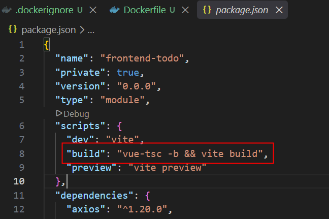

<style>
@import url('https://fonts.googleapis.com/css2?family=Prompt:ital,wght@0,100;0,300;0,400;0,700;1,100;1,300;1,400;1,700&display=swap');

    :root {
    font-family: Prompt;
    --hl-color: #D57E7E;
}
h1 {
  font-family: Prompt
}
img {
  border-radius: 0.5rem; 
}
</style>

# Information Technologies for Industrial Engineers

---

# Deployment

---

# Goal

- We will containerize the backend and frontend applications using Docker and deploy them to a server.
- On the server we will use Linux without GUI.
  - No `Dbeaver`, no `Docker Desktop`, no mouse.
- Terminal
  - `Windows` - `Git Bash`
  - `Mac` - `Terminal`

---

# Git Bash Tip

- To paste commands
  - Right click to paste
  - `Shift + Insert` to paste
- Use `VSCode` terminal with `Git Bash` as the default shell.
  - You can use the normal `Ctrl + V` to paste commands.

---

# Variable in Bash

- Define a variable
  `MY_VARIABLE='Hello World'`
- Inspect the variable
  `echo ${MY_VARIABLE}`
- Interpolate the variable in a command
  `echo "The message is: ${MY_VARIABLE}"`

> Notice the single quote `'` and double quote `"` difference. Single quote will not interpolate the variable.

---

# Docker Setup

```bash
DOCKER_VOLUME_NAME='g99_volume'
DOCKER_NETWORK_NAME='g99_network'
```

- Create volume
  `docker volume create ${DOCKER_VOLUME_NAME}`
- List the volume
  `docker volume ls`
- Create network
  `docker network create ${DOCKER_NETWORK_NAME}`
- List the network
  `docker network ls`

---

# Why network?

- The backend container needs to connect to the database container.
  - The url is no longer `localhost` because the backend container is running in a different container than the database container.
  - This is like a separate computer connecting to a database server.
- Without a network
  - We need the **IP address** of the database container.
  - Unstable -> IP changes every time we restart the container.
- With a network
  - We use the **container name** as the hostname
  - Stable

---

# Database

```bash
DB_IMAGE_NAME='postgres:latest'
DB_CONTAINER_NAME='g99_db'
DB_PASSWORD='6&zi9!%BYCUZo6B'
DB_PORT='4099'
```

- Create a container

`docker run -d --name ${DB_CONTAINER_NAME} -e POSTGRES_PASSWORD=${DB_PASSWORD} -v ${DOCKER_VOLUME_NAME}:/var/lib/postgresql --network ${DOCKER_NETWORK_NAME} -p ${DB_PORT}:5432 ${DB_IMAGE_NAME}`

---

# Explanation for the command

| Option             | Description                                    |
| ------------------ | ---------------------------------------------- |
| `-d`               | Run the container in detached mode             |
| `--name`           | Assign a name to the container                 |
| `-e`               | Set environment variables in the container     |
| `-v`               | Mount a volume to the container                |
| `--network`        | Connect the container to a network             |
| `-p`               | Publish a container's port to the host         |
| `${DB_IMAGE_NAME}` | The name of the image to use for the container |

---

# Database

- Inspect the list of container
  `docker ps -a`
- Insepct the container
  `docker inspect ${DB_CONTAINER_NAME}`
- Delete the container, volume, and network if you want to start over
  `docker rm -f ${DB_CONTAINER_NAME}`
  `docker volume rm ${DOCKER_VOLUME_NAME}`
  `docker network rm ${DOCKER_NETWORK_NAME}`

---

# Connect to Database

We will use `psql` to create a database and a table. Think about `psql` as `Dbeaver`.

- Go into the container
  `docker exec -it ${DB_CONTAINER_NAME} bash`
- Connect to the database
  `psql -U postgres`

---

# Create Database

- Create a database
  `CREATE DATABASE app_db;`
- Check the database
  `\l`
- Connect to the database
  `\c app_db`
- Check connection
  `\conninfo`

---

# Create Table

- Create table

```sql
CREATE TABLE IF NOT EXISTS
  todos (
    id serial PRIMARY KEY,
    title VARCHAR(50) NOT NULL,
    completed BOOLEAN NOT NULL DEFAULT FALSE,
    created_at TIMESTAMPTZ NOT NULL DEFAULT NOW()
  );
```

- Check the table
  `\dt` or `SELECT * FROM todos;`

---

# Exit

- Exit `psql`
  `\q`
- Exit the container
  `exit`

---

# Common Mistakes in `psql`

- Forget `;` at the end of the command.
  - ❌ `CREATE DATABASE app_db`
  - ✅ `CREATE DATABASE app_db;`
- Use `/` instead of `\` for commands.
  - ❌ `/l`
  - ✅ `\l`
- Forget to connect to the database before creating a table.
  - ❌ `CREATE TABLE todos ...`
  - ✅ `\c app_db` then `CREATE TABLE todos ...`

---

# Backend Starter

- `git clone https://github.com/it-for-ie-69/backend-deploy`
- `cd backend-deploy`
- Create `.env` file from `.env.example` and set the database password to your own password.
- `pnpm i`
- `pnpm run dev`
- `pnpm run build`

> Visit `http://localhost:3000/todos` to see the backend is running and can connect to the database.

---

# Prepare Backend for Docker

- Create `Dockerfile` from here
  - This is the recipe to build the backend image.
- Create `.dockerignore` from here
  - This is the list of files and folders that we don't want to include in the image.

---

# Build Backend Image

> Make sure you use 'Git Bash' on `VSCode` terminal and you are in the `backend-deploy` folder.

```bash
BACKEND_IMAGE_NAME='g99_backend_image'
```

- Build the image
  `docker build -t ${BACKEND_IMAGE_NAME} .`
- Check the image
  `docker images`
- Remove the image if you want to start over
  `docker rmi ${BACKEND_IMAGE_NAME}`

---

# Run Backend Container

```bash
BACKEND_CONTAINER_NAME='g99_backend'
BACKEND_PORT=5099

# These are the env from the .env file that we need to pass to the container
PGUSER=postgres
PGHOST=${DB_CONTAINER_NAME}
PGDATABASE=app_db
PGPASSWORD=${DB_PASSWORD}
PGPORT=5432
```

`docker run -d --name ${BACKEND_CONTAINER_NAME} -p ${BACKEND_PORT}:3000 --network ${DOCKER_NETWORK_NAME} -e PGUSER=${PGUSER} -e PGHOST=${PGHOST} -e PGDATABASE=${PGDATABASE} -e PGPASSWORD=${PGPASSWORD} -e PGPORT=${PGPORT} ${BACKEND_IMAGE_NAME}`

---

# DB Connection Confusion

Consider this setup

```bash
PGHOST=${DB_CONTAINER_NAME} # i.e. g99_db
PGPORT=5432
```

- The host is no longer `localhost` because the backend container is running in a different container than the database container.
- The port is no longer `4099` because the backend container is connecting to the database container directly, not through the host machine.

---

# Frontend

- Make proxy server in `vite.config.ts` to forward the request to the backend container.
- Change `const baseURL = "/api";`

---



---

```bash
FRONTEND_IMAGE_NAME='g99_frontend_image'
```

`docker build -t ${FRONTEND_IMAGE_NAME} .`

---

```bash
FRONTEND_CONTAINER_NAME='g99_frontend'
FRONTEND_PORT=6099
BACKEND_URL=http://${BACKEND_CONTAINER_NAME}:3000
```

`docker run -d --name ${FRONTEND_CONTAINER_NAME} -p ${FRONTEND_PORT}:81 --network ${DOCKER_NETWORK_NAME} -e NGINX_PROXY_PASS=${BACKEND_URL} ${FRONTEND_IMAGE_NAME}`

---

# What is port 81 and 3000?

- Port 81 is the port that the frontend container is listening to.

```
server {
    listen 81;
    listen [::]:81;
    server_name localhost;
}
```

- Port 3000 is the port that the backend container is listening to.
